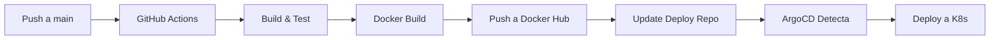

# CI/CD Pipeline - Biblioteca CQRS

## 📝 Descripción

Este workflow implementa un pipeline CI/CD completo para la aplicación biblioteca-cqrs usando GitHub Actions, integrándose con ArgoCD para despliegue continuo en Kubernetes.

## 🔄 Flujo Completo



## 🚀 Pasos del Pipeline

### 1. **Trigger**
- Se activa automáticamente con `push` a la rama `main`
- También se puede ejecutar manualmente desde GitHub Actions UI

### 2. **Build & Test**
```bash
./mvnw clean test        # Ejecuta tests unitarios
./mvnw package -DskipTests  # Compila el JAR
```

### 3. **Versionado**
- Genera un tag único: `1.0.{BUILD_NUMBER}-{GIT_SHA}`
- Ejemplo: `1.0.42-a3f7c91`
- También etiqueta como `:latest`

### 4. **Docker Build & Push**
- Construye imagen usando Dockerfile multi-stage
- Sube a Docker Hub: `leounisabana/biblioteca-cqrs`
- Tags: versión específica + latest

### 5. **Update Deploy Repo**
- Clona el repositorio `biblioteca-cqrs-deploy`
- Actualiza el tag de imagen en `values-dev.yaml`
- Hace commit y push del cambio

### 6. **ArgoCD (Automático)**
- ArgoCD detecta el cambio en el repo de deploy (polling ~3 min)
- Sincroniza automáticamente con Kubernetes
- Despliega la nueva versión

## ⚙️ Configuración Inicial

### 1. Configurar Secretos

Ver [README-SECRETS.md](./README-SECRETS.md) para instrucciones detalladas.

Necesitas configurar en **Settings → Secrets and variables → Actions**:
- `DOCKER_USERNAME`: Usuario de Docker Hub
- `DOCKER_PASSWORD`: Password o Access Token de Docker Hub
- `GH_PAT`: GitHub Personal Access Token con permisos `repo`

### 2. Verificar Variables de Entorno

En `ci-cd.yml`, verifica que estas variables sean correctas:

```yaml
env:
  DOCKER_IMAGE: leounisabana/biblioteca-cqrs
  DEPLOY_REPO: LeoUnisabana/biblioteca-cqrs-deploy
  DEPLOY_VALUES_FILE: helm/biblioteca-chart/values-dev.yaml
```

## 🧪 Probar el Pipeline

### Opción 1: Push a main (Automático)

```bash
# Hacer un cambio en el código
echo "# Test CI/CD" >> README.md
git add .
git commit -m "test: trigger CI/CD pipeline"
git push origin main
```

### Opción 2: Ejecución Manual

1. Ve a GitHub → Actions
2. Selecciona "CI/CD Pipeline - Biblioteca CQRS"
3. Click en "Run workflow"
4. Selecciona la rama `main`
5. Click en "Run workflow"

## 📊 Monitorear el Pipeline

### En GitHub Actions
1. Ve a tu repositorio en GitHub
2. Click en la pestaña "Actions"
3. Verás el workflow en ejecución
4. Click en el workflow para ver logs detallados

### En Docker Hub
1. Ve a https://hub.docker.com/r/leounisabana/biblioteca-cqrs
2. Verás la nueva imagen con el tag generado

### En ArgoCD
1. Accede a ArgoCD UI: https://localhost:8080
2. Login: `admin` / `6G6Q8w9oGt3BYyCI`
3. Monitorea la aplicación `biblioteca-cqrs`
4. Verás el estado de sincronización

### En Kubernetes
```bash
# Ver el rollout en progreso
kubectl rollout status deployment/biblioteca-cqrs -n default

# Ver pods
kubectl get pods -n default

# Ver la nueva imagen desplegada
kubectl describe pod -n default | grep Image:
```

## 🐛 Troubleshooting

### Error: "Authentication failed" en Docker Hub
- Verifica que los secretos `DOCKER_USERNAME` y `DOCKER_PASSWORD` estén correctos
- Si usas 2FA, debes usar un Access Token, no tu contraseña

### Error: "Permission denied" al actualizar deploy repo
- Verifica que el secreto `GH_PAT` tenga permisos `repo`
- El token debe tener acceso al repositorio `biblioteca-cqrs-deploy`

### ArgoCD no detecta cambios
- Espera 3 minutos (polling interval)
- O sincroniza manualmente en ArgoCD UI:
  ```bash
  kubectl port-forward svc/argocd-server -n argocd 8080:443
  # En la UI: Click en SYNC en la aplicación
  ```

### Tests fallan
- Revisa los logs en GitHub Actions
- Ejecuta localmente:
  ```bash
  ./mvnw clean test
  ```

## 📈 Métricas del Pipeline

Tiempos estimados:
- ⏱️ Build & Test: ~2-3 minutos
- ⏱️ Docker Build: ~3-4 minutos
- ⏱️ Push a Docker Hub: ~1-2 minutos
- ⏱️ Update Deploy Repo: ~10 segundos
- ⏱️ ArgoCD Sync: ~2-3 minutos
- **Total: ~10-15 minutos** desde commit hasta pods corriendo

## 🔒 Seguridad

- ✅ Usa secretos de GitHub para credenciales
- ✅ Imágenes Docker construidas en cada commit
- ✅ Separación entre código fuente y configuración de deploy
- ✅ ArgoCD como única fuente de verdad para el cluster
- ✅ GitOps: Todo cambio es rastreable en Git

## 📚 Recursos Adicionales

- [GitHub Actions Docs](https://docs.github.com/en/actions)
- [Docker Build Push Action](https://github.com/docker/build-push-action)
- [ArgoCD Documentation](https://argo-cd.readthedocs.io/)
